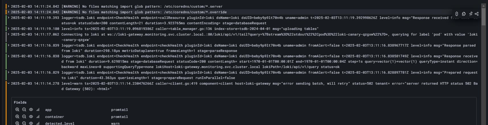

## Install  K3d
curl -s https://raw.githubusercontent.com/k3d-io/k3d/main/install.sh | bash

## Install helm
```bash
curl https://baltocdn.com/helm/signing.asc | sudo tee /etc/apt/trusted.gpg.d/helm.asc > /dev/null
echo "deb https://baltocdn.com/helm/stable/debian/ all main" | sudo tee /etc/apt/sources.list.d/helm-stable-debian.list

sudo apt update && sudo apt install helm -y

```

## Create parent helm chart
```bash
helm create helm-parent


helm uninstall http-time
helm uninstall adminer
helm uninstall dev-js
helm uninstall kubernetes-dashboard -n kubernetes-dashboard
helm uninstall prometheus -n monitoring

helm dependency update helm/charts/dev-env
helm template helm/charts/dev-env/
helm upgrade --install dev-env helm/charts/dev-env


helm uninstall dev-env


# helm upgrade --install kubernetes-dashboard helm/charts/kubernetes-dashboard \
# --namespace kubernetes-dashboard --create-namespace
#  helm template helm/charts/kubernetes-dashboard/

```

## Initialize cluster

```bash
k3d cluster delete dev-cluster \
&& k3d cluster create --config cluster-config.yaml \
&& kubectl apply -f https://raw.githubusercontent.com/traefik/traefik/v3.3/docs/content/reference/dynamic-configuration/kubernetes-crd-definition-v1.yml

```

## Import secrets/configmaps

```bash
kubectl apply -f k8s/manifests/secrets/mariadb.yaml
kubectl apply -f k8s/manifests/configmaps/php-config.yaml


# delete me
# kubectl delete secret kubernetes-dashboard-csrf -n kubernetes-dashboard
# kubectl create secret generic kubernetes-dashboard-csrf -n kubernetes-dashboard --from-literal=csrf=$(head -c 16 /dev/urandom | base64)


```

## Traefik

```bash
kubectl apply -f k8s/manifests/configmaps/traefik-config.yaml \
&& kubectl apply -f k8s/manifests/base/traefik/role.yaml \
&& kubectl apply -f k8s/manifests/base/traefik/account.yaml \
&& kubectl apply -f k8s/manifests/base/traefik/role-binding.yaml \
&& kubectl apply -f k8s/manifests/base/traefik/deployment.yaml \
&& kubectl apply -f k8s/manifests/base/traefik/service.yaml\
&& kubectl apply -f k8s/manifests/apps/traefik-dashboard/service.yaml\
&& kubectl apply -f k8s/manifests/apps/traefik-dashboard/ingress.yaml
```
### Access traaefik the dashboard
Go to https://k8s.home3.jlb.ninja/dashboard/


### import required images

```bash
k3d image import faker-mysql-php --cluster dev-cluster
k3d image import k3d-php:latest -c dev-cluster
k3d image import dev-js:latest --cluster dev-cluster
k3d image import pecule-api:latest --cluster dev-cluster

```


## Install helm charts

```bash
helm uninstall development
helm dependency update helm/charts/_dev
helm upgrade --install development helm/charts/_dev


helm uninstall monitoring -n monitoring
helm dependency update helm/charts/_monitoring
helm upgrade --install monitoring helm/charts/_monitoring \
--namespace monitoring --create-namespace

```


___


##  Kubernetes Dashboard

```bash
kubectl apply -f https://raw.githubusercontent.com/kubernetes/dashboard/v2.7.0/aio/deploy/recommended.yaml

# Create the account
kubectl apply -f k8s/manifests/apps/kubernetes-dashboard/account.yaml

# Create and get the idetification token
kubectl -n kubernetes-dashboard create token admin-user

# Apply ingress
kubectl apply -f k8s/manifests/apps/kubernetes-dashboard/ingress.yaml

```

### Access the dashboard
Go to https://kubernetes-dashboard.k8s.home3.jlb.ninja/#/workloads?namespace=default

___


## Grafana

### Init repo if necessary
```bash
helm repo add grafana https://grafana.github.io/helm-charts
helm repo update
```

### Install Grafana

```bash
helm install grafana grafana/grafana \
--namespace monitoring --create-namespace \
--set adminPassword="admin" \
--set persistence.enabled=true \
--set persistence.size=10Gi \
--set persistence.storageClassName=local-path

# apply ingress
kubectl apply -f k8s/manifests/apps/grafana/ingress.yaml
```


#### Check Grafana the password
```bash
kubectl get secret --namespace monitoring grafana -o jsonpath="{.data.admin-password}" | base64 --decode ; echo
```

### Install Loki
```bash
helm install loki grafana/loki \
-n monitoring \
-f k8s/manifests/apps/loki/values.yaml


```

### Install promptail
```bash
helm install promtail grafana/promtail -n monitoring
```

### Install prometheus

#### Init repo if necessary
```bash
helm repo add prometheus-community https://prometheus-community.github.io/helm-charts
helm repo update
```

#### Install prometheus
```bash
helm upgrade --install prometheus prometheus-community/kube-prometheus-stack \
--namespace monitoring --create-namespace \
--set prometheus-node-exporter.enabled=true


helm upgrade --install prometheus helm/charts/kube-prometheus-stack \
--namespace monitoring --create-namespace \
--set prometheus-node-exporter.enabled=true
```

#### Access prometheus dashboard
Go to https://prometheus.k8s.home3.jlb.ninja/query

### Access the dashboard
Go to https://grafana.k8s.home3.jlb.ninja/
- User: admin
- Password: admin

### Create Loki datasource in Grafana
Add new Loki datasource
URL : http://loki-gateway.monitoring.svc.cluster.local


### Test loki

In the explore section, use the following query :
```
{job=~".+"}
```

Should display logs



#### Add Prometheus datasource in Grafana
Use full qualified domain name :

```
http://<service-name>.<namespace>.svc.cluster.local
http://prometheus-operated.monitoring.svc.cluster.local:9090
```

### Usefull dashboards
- 15661: [K8S Dashboard EN 20250125](https://grafana.com/grafana/dashboards/15661-k8s-dashboard-en-20250125/)

- 159: [Prometheus system](https://grafana.com/grafana/dashboards/159-prometheus-system/) (Prometheus system metrics dashboard)
- 17501: [Traefik On K8s Via Loki](https://grafana.com/grafana/dashboards/17501-traefik-via-loki/)


- 13639: [Logs / App](https://grafana.com/grafana/dashboards/13639-logs-app/) (Simple loki log viewer)
- 15141: [Loki Kubernetes Logs](https://grafana.com/grafana/dashboards/15141-kubernetes-service-logs/)
- 14057: [MySQL Exporter Quickstart and Dashboard](https://grafana.com/grafana/dashboards/14057-mysql/)


### Uninstall Grafana

```bash
helm uninstall grafana -n monitoring
helm uninstall loki -n monitoring
helm uninstall promtail -n monitoring
helm uninstall prometheus -n monitoring
```


### Some test commands

```bash
kup -n monitoring
kul  -n monitoring loki-write-0
kul  -n monitoring grafana-767bfc6-bbvbj
kul  -n monitoring loki-backend-0
kul  -n monitoring  loki-canary-l56zz
kug  -n monitoring  svc
```
___


## Portainer

### Init repo if necessary

```bash
helm repo add portainer https://portainer.github.io/k8s
helm repo update
```

### Install Portainer

```bash
# can take a while to start ; (some minutes)
helm upgrade --install portainer portainer/portainer \
--set service.type=ClusterIP \
--set service.port=9000 \
--set ingress.tls=""

# Apply ingress
kubectl apply -f k8s/manifests/apps/portainer/ingress.yaml


# does not work ; kept for reference
# generate password
# htpasswd -bnBC 10 "" admin | tr -d ':\n'
# --set features.flag='--admin-password=$2y$10$MTj9Q4dC1g.PSs7fik9.8O.u9Yt/s6ecxhuP2t/26oq2bAPXX5TpK'

```

### Connect to Portainer

Go to https://portainer.k8s.home3.jlb.ninja/


### Uninstall Portainer

```bash
helm uninstall portainer
```

___

## Elasticsearch

### Init repo if necessary

```bash
helm repo add bitnami https://charts.bitnami.com/bitnami
helm repo update
```

### Install Elasticsearch
```bash
# can take a while to start ; (some vey long minutes)
helm install elastic bitnami/elasticsearch \
--set security.enabled=false
```

### Uninstall Elasticsearch
```bash
helm uninstall elastic
```

___

## Kibana

```bash
# Install kibana
helm install kibana bitnami/kibana \
--set elasticsearch.host="elastic-elasticsearch" \
--set elasticsearch.port=9200 \
--set elasticsearch.hosts[0]="elastic-elasticsearch"

# Apply manifests
kubectl apply -f k8s/manifests/secrets/kibana.yaml
kubectl apply -f k8s/manifests/apps/kibana/middlewares/basic-auth.yaml
kubectl apply -f k8s/manifests/apps/kibana/ingress.yaml
```

### Uninstall Kibana
```bash
helm uninstall kibana
```

### Access the dashboard

May require pod deletion

Go to https://kibana.k8s.home3.jlb.ninja/

- User: kibana
- Password: kibana

___


## MariaDB

```bash

kubectl apply -f k8s/manifests/apps/mariadb/pv.yaml \
&& kubectl apply -f k8s/manifests/secrets/mariadb.yaml \
&& kubectl apply -f k8s/manifests/apps/mariadb/pvc.yaml \
&& kubectl apply -f k8s/manifests/apps/mariadb/service.yaml \
&& kubectl apply -f k8s/manifests/apps/mariadb/deployment.yaml

```

### Add mariadb datasource in Grafana
Use full qualified domain name :

```
<service-name>.<namespace>.svc.cluster.local
mariadb.default.svc.cluster.local
```

- User: root
- Password: secret-root-pass

___
## Adminer

```bash
helm install adminer helm/charts/adminer --namespace default
```
### Connect to Adminer
Go to https://adminer.k8s.home3.jlb.ninja/
- User: root
- Password: secret-root-pass

___

## Prometheus mysqld_exporter

```bash
helm upgrade --install mysql-exporter ./helm/charts/prometheus-mysql-exporter \
--namespace monitoring --create-namespace \
--set mysql.user="root" \
--set mysql.pass="secret-root-pass" \
--set mysql.host="mariadb.default.svc.cluster.local" \
--set mysql.port="3306"


kubectl apply -f k8s/manifests/apps/mysqld-exporter/service-monitor.yaml

```


___

## Populate test database

### Build the image if necessary

```bash
docker build --no-cache -t faker-mysql-php -f docker/faker-mysql-php
docker tag faker-mysql-php k3d-dev-cluster/faker-mysql-php
```

### Import fake data

```bash
k3d image import faker-mysql-php --cluster dev-cluster \
&& kubectl apply -f k8s/manifests/secrets/mariadb.yaml \
&& kubectl apply -f k8s/manifests/jobs/faker-mysql-php.yaml \
&& sleep 10 \
&& kubectl logs -l job-name=populate-mariadb
```
___

## PHP development environment

### Build the PHP image if necessary
```bash
docker build -t k3d-php:latest -f docker/php/Dockerfile .
```

### Import image and apply manifests

```bash
k3d image import k3d-php:latest -c dev-cluster \
&& kubectl apply -f k8s/manifests/configmaps/php-config.yaml \
&& kubectl apply -f k8s/manifests/apps/php/service.yaml \
&& kubectl apply -f k8s/manifests/apps/php/deployment.yaml \
&& kubectl apply -f k8s/manifests/apps/php/ingress.yaml
```

### Test the service

Go to the url : https://php.k8s.home3.jlb.ninja/

Should return informations on the "Green" version of the service


### Change the image version

```bash
kubectl patch service php-service -p '{"spec": {"selector": {"app": "php", "version": "blue"}}}'
```


___

## nodejs

### build the image if necessary
```bash
docker build -t dev-js:latest -f docker/dev-js/Dockerfile .
```

### Import image and apply manifests

```bash
k3d image import dev-js:latest --cluster dev-cluster \
&& helm upgrade --install dev-js helm/charts/dev-js
```

### Test server if necessary

```js
const http = require("http");
const port = 3000;
http.createServer((req, res) => {
  res.end("Hello World!");
}).listen(port);
console.log("Server running on port " + port);

```


### Test the service

```bash
# connect to the pod
kubectl exec -it $(kubectl get pod -l app=dev-js -o jsonpath='{.items[0].metadata.name}') -- bash
# then lauch test server
node server.js
```
Check url : https://dev-js.k8s.home3.jlb.ninja/

Should return "Hello World"


___

##  Time http service

This service is a simple http service using busybox that returns the current time. Used for testing purposes.

```bash
helm install http-time helm/charts/http-time --namespace default
```

### Test the service
Go to the url : https://time.k8s.home3.jlb.ninja/

Should return the current time


## Pecule API

### build the image if necessary
```bash
docker build --no-cache -t pecule-api:latest -f docker/pecule-api/Dockerfile .
```


### Install

```bash
kubectl apply -f k8s/manifests/configmaps/pecule-api-config.yaml

k3d image import pecule-api:latest --cluster dev-cluster \
&& helm upgrade --install pecule-api helm/private-charts/pecule-api


```


___


## NOT USED Install ArgoCD


### Init repo if necessary
```bash
helm repo add argo https://argoproj.github.io/argo-helm
helm repo update
```


```bash
helm upgrade --install argo-cd argo/argo-cd \
--namespace argocd --create-namespace \
--set server.enableWebExec=true \
--set server.insecure=true


helm upgrade --install argo-cd argo/argo-cd \
--namespace argocd --create-namespace

kubectl get cm -n argocd argocd-cm -o yaml

# Apply ingress
kubectl apply -f k8s/manifests/apps/argocd/ingress.yaml
```

### Get the admin password
```bash
kubectl -n argocd get secret argocd-initial-admin-secret -o jsonpath="{.data.password}" | base64 -d
```

### Access the dashboard
Go to https://argocd.k8s.home3.jlb.ninja/
- User: admin
- Password: <password>


___


```


### Uninstall Grafana

```bash
helm uninstall grafana -n monitoring
```


# Créer un cluster K3d avec un load balancer (ports 80 et 443 exposés)
k3d cluster create dev-cluster -p "80:80@loadbalancer" -p "443:443@loadbalancer"

# Vérifier que le cluster est bien créé
k3d cluster list
kubectl cluster-info


___

# Construire l'image Docker PHP
docker build --no-cache -t test-k3d:latest -f ./docker/php/Dockerfile .

# Importer l'image dans le cluster K3d
k3d image import test-k3d:latest -c dev-cluster

# Vérifier si l'image est bien disponible sur les nœuds Kubernetes
kubectl get nodes -o wide

___

# Supprimer un pod PHP si nécessaire
kubectl delete pod test-container

# Lancer manuellement un conteneur PHP dans Kubernetes (mode debug)
kubectl run test-container --image=test-k3d:latest --restart=Never --image-pull-policy=Never

# Vérifier que le pod est bien en cours d'exécution
kubectl get pods

___

# Appliquer toutes les configurations (services, ingress, déploiement)
kubectl apply -f k8s/k8s/manifests/

# Vérifier les services et ingress disponibles
kubectl get services
kubectl get ingress

# Vérifier que le service `php-service` est bien attaché à un pod
kubectl get service php-service -o yaml | grep selector -A 2

# Vérifier que Traefik est bien en place
kubectl get services -n kube-system | grep traefik
kubectl get endpoints -n kube-system | grep traefik


___

# Construire l'image Docker PHP
docker build -t test-k3d:latest -f docker/php/Dockerfile .

# Importer l'image dans le cluster K3d
k3d image import test-k3d:latest -c dev-cluster

# Vérifier si l'image est bien disponible sur les nœuds Kubernetes
kubectl get nodes -o wide

# Supprimer un pod PHP si nécessaire
kubectl delete pod test-container

# Lancer manuellement un conteneur PHP dans Kubernetes (mode debug)
kubectl run test-container --image=test-k3d:latest --restart=Never --image-pull-policy=Never

# Vérifier que le pod est bien en cours d'exécution
kubectl get pods

# Appliquer toutes les configurations (services, ingress, déploiement)
kubectl apply -f k8s/k8s/manifests/

# Vérifier les services et ingress disponibles
kubectl get services
kubectl get ingress

# Vérifier que le service `php-service` est bien attaché à un pod
kubectl get service php-service -o yaml | grep selector -A 2

# Vérifier que Traefik est bien en place
kubectl get services -n kube-system | grep traefik
kubectl get endpoints -n kube-system | grep traefik

# Vérifier si les fichiers sont bien montés dans le pod PHP
kubectl exec -it $(kubectl get pod -l app=php -o jsonpath='{.items[0].metadata.name}') -- ls -al /var/www/html

# Vérifier où Apache cherche ses fichiers
kubectl exec -it $(kubectl get pod -l app=php -o jsonpath='{.items[0].metadata.name}') -- apachectl -S

# Vérifier si le volume `php-code` est bien monté dans Kubernetes
kubectl describe pod -l app=php | grep -A5 "Volumes"
kubectl describe pod -l app=php | grep -A10 "Mounts"

# Vérifier les endpoints du service PHP (doit afficher une IP si tout est OK)
kubectl get endpoints php-service

# Vérifier que l'Ingress est bien enregistré dans Kubernetes
kubectl describe ingress php-ingress

# Supprimer et recréer l'Ingress pour forcer une mise à jour
kubectl delete ingress php-ingress
kubectl apply -f k8s/k8s/manifests/ingress.yaml

# Redémarrer Traefik si des changements ont été faits
kubectl delete pod -n kube-system -l app.kubernetes.io/name=traefik

# Supprimer complètement le cluster
k3d cluster delete dev-cluster

# Recréer le cluster avec un volume monté (WSL2 spécifique)
k3d cluster create dev-cluster -p "80:80@loadbalancer" --volume /mnt/d/__wsl/k3d:/mnt/d/__wsl/k3d

# Réimporter l'image PHP
k3d image import test-k3d:latest -c dev-cluster

# Redéployer les services et pods
kubectl apply -f k8s/k8s/manifests/service.yaml
kubectl apply -f k8s/k8s/manifests/deployment.yaml
kubectl apply -f k8s/k8s/manifests/ingress.yaml

# Redémarrer Traefik après un changement de cluster
kubectl delete pod -n kube-system -l app.kubernetes.io/name=traefik

# Vérifier si un dossier est bien visible dans un conteneur Docker
docker run --rm -v /mnt/d/__wsl/k3d:/mnt/test alpine ls -al /mnt/test

# Changer les permissions si WSL2 bloque l'accès
sudo chmod -R 777 /mnt/d/__wsl/k3d


___


# Installer K3d
curl -s https://raw.githubusercontent.com/k3d-io/k3d/main/install.sh | bash

# Installer helm
curl https://raw.githubusercontent.com/helm/helm/master/scripts/get-helm-3 | bash

# Add the Traefik repository
helm repo add traefik https://traefik.github.io/charts
helm repo update

___


# Construire l'image Docker PHP
docker build --no-cache -t test-k3d:latest -f ./docker/php/Dockerfile .

___


delete all services, pods, ingress etc...

```bash
kubectl delete pods --all --namespace=default
kubectl delete services --all --namespace=default
kubectl delete ingress --all --namespace=default
kubectl delete secrets --all --namespace=default
kubectl delete configmaps --all --namespace=default
kubectl delete deployments --all --namespace=default
kubectl delete pvc --all --namespace=default
kubectl delete pv --all


kubectl delete pods --all
kubectl delete services --all
kubectl delete ingress --all
kubectl delete secrets --all
kubectl delete configmaps --all
kubectl delete deployments --all
kubectl delete pvc --all
kubectl delete pv --all

```


kubectl rollout restart deployment traefik-deployment -n default


## import image
k3d image import faker-mysql-php --cluster dev-cluster

kubectl apply -f k8s/manifests/jobs/faker-mysql-php.yaml
kubectl logs -l job-name=populate-mariadb


## Delete deployment, avoid auto restart
kubectl delete deployment mariadb


